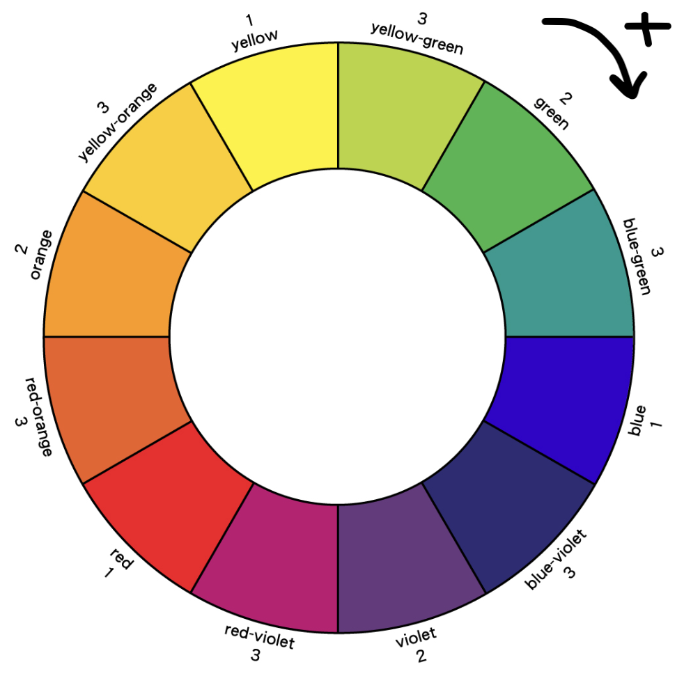
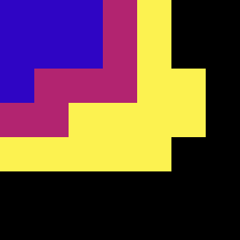

<h1 align="center">Gratie ("grah-tee")</h1>

  

  
  

My version of the [Piet programming language](https://dangermouse.net/esoteric/piet.html). Made in collaboration with Jordan during the first half of the W1'24 batch at the [Recurse Center](https://www.recurse.com/).

(Piet Mondrian was a *Dutch* artist. According to Google Translate, "gratie" is Dutch for "grace"!)

## Design

I designed Gratie to be a minimalist version of Piet while retaining its esoteric-ness. The main components of the interpreter are the parser (parses the text-based input program), grid (stores the parsed input as a grid of `Colors`), and stack (stores the values of the program). We put all the pieces together with the program execution logic in `interpreter.rs`.

## Usage

To write your own Gratie program:
1. Specify pixel colors in a comma-separated text file. These are the colors:

and this is the mapping from hue change steps to command:

| Hue change steps | Command       |
|------------------|---------------|
| 1                | add           |
| 2                | multiply      |
| 3                | pop           |
| 4                | in(char)      |
| 5                | out(number)   |
| 6                | duplicate     |
| 7                | out(char)     |
| 8                | in(number)    |
| 9                | push          |
| 10               | divide        |
| 11               | subtract      |

2. Run `cargo build && ./target/debug/gratie -d PATH/TO/YOUR_PROGRAM.txt` to run the repl. Currently, the available commands are `step` (execute one command) and `run` (run entire program and print result).

## Examples
Push 3 onto the stack

Print 7 to the console

## Acknowledgements

### Helpful resources on how Piet works

- [Visual video explanation of what's going on with the "direction pointer" and "codel chooser"](https://youtu.be/IcmCvT5whk0?si=cvZTspfWsUEzuZf1&t=402)
- [User-friendly in-browser Piet IDE done by a former Recurser](https://gabriellesc.github.io/piet/) and [another one](https://piet-editor.github.io/)
- [Examples for implementing control flow in Piet](https://web.archive.org/web/20190818054404/http://homepages.vub.ac.be/~diddesen/piet/index.html)

## License

Gratie is licensed under the MIT License Copyright (c) 2025.

See the LICENSE for information on the history of this software, terms & conditions for usage, and a DISCLAIMER OF ALL WARRANTIES.

All trademarks referenced herein are property of their respective holders.
